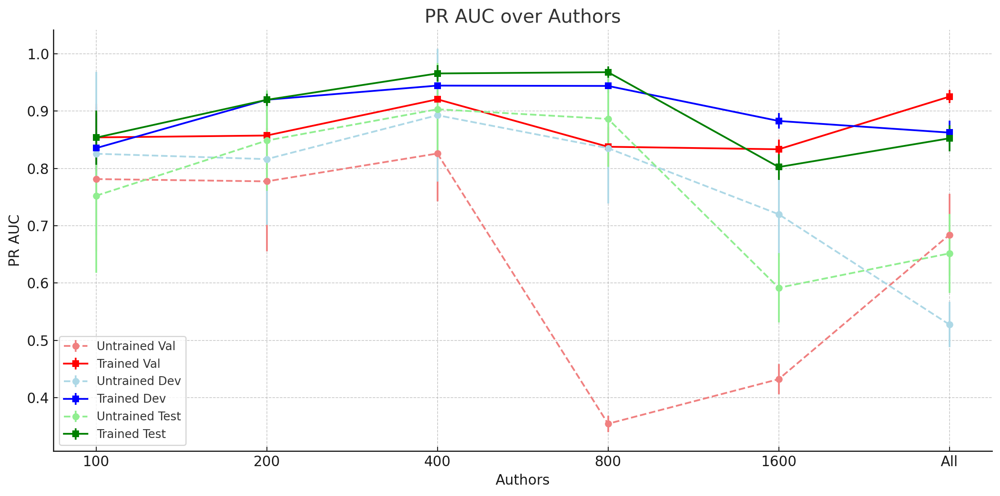
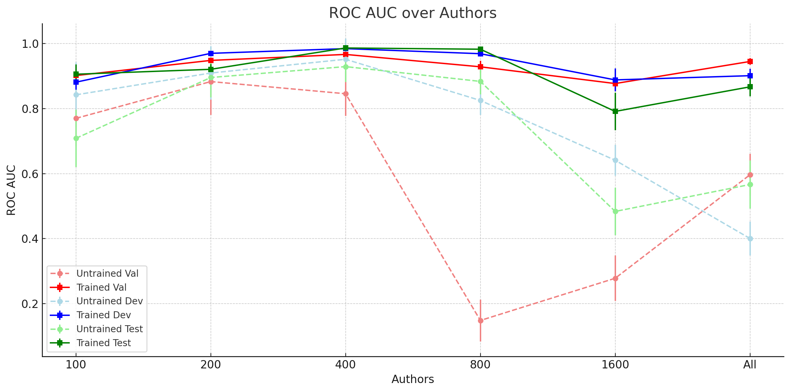

# iKIETS: Inductive Knowledge-Infused Edge Transformer for Scientific Collaboration

This project implements a graph neural network-based approach for predicting future scientific collaborations using the OpenAlex dataset. The model learns from historical collaboration patterns, author metadata, and institutional information to predict potential future collaborations between researchers.

## Problem Statement

The task is to predict potential future collaborations between researchers in computer science based on their previous collaboration history and metadata. This is formulated as a link prediction problem in a dynamic graph where:
- Nodes represent authors
- Edges represent collaborations (co-authorship)
- Node features include citation counts and publication counts
- Edge features are derived from paper titles using sentence embeddings
- Temporal splits are used to evaluate the model's predictive power

## Components

### Dataset (`dataset.py`)

The `OpenAlexGraphDataset` class handles data processing and preparation:
- Loads and processes JSON data from OpenAlex containing CS papers
- Constructs a collaboration graph with authors as nodes
- Computes node features:
  - Citation counts (normalized)
  - Work counts (normalized) 
  - Institution embeddings using SentenceTransformer
- Computes edge features from paper titles using SentenceTransformer
- Implements temporal splitting (70% train, 10% val, 10% dev-test, 10% test)
- Supports caching for faster loading

### Model (`model.py`)

The model architecture consists of:
- Custom `EdgeSAGEConv` layer that extends MessagePassing:
  - Processes both node and edge features
  - Uses mean aggregation
  - Combines neighbor and self information
- `LinkPredictionModel` implementing the full architecture:
  - Multiple EdgeSAGE layers with batch normalization
  - Dropout for regularization
  - Decoder for computing link probabilities
  - Optimized for binary classification (link exists/doesn't exist)

### Training (`main.py`)

The training pipeline includes:
- Negative sampling for generating non-existing edges
- Early stopping based on validation performance
- Learning rate scheduling
- Multiple evaluation metrics (ROC-AUC and PR-AUC)
- Support for multiple runs with different random seeds
- Hyperparameter configuration

## Results

The following results show the model's performance across different dataset sizes (number of authors) for both untrained and trained states:

# Experiment results

| Authors | Untrained Val roc_auc | Final Val roc_auc | Untrained Val pr_auc | Final Val pr_auc | Untrained Dev Test roc_auc | Final Dev Test roc_auc | Untrained Dev Test pr_auc | Final Dev Test pr_auc | Untrained Test roc_auc | Final Test roc_auc | Untrained Test pr_auc | Final Test pr_auc |
| :------ | :-------------------- | :---------------- | :------------------- | :--------------- | :------------------------- | :--------------------- | :------------------------ | :-------------------- | :--------------------- | :----------------- | :-------------------- | :---------------- |
| 100     | 0.7701 ± 0.0858       | 0.9017 ± 0.0202   | 0.7813 ± 0.1261      | 0.8540 ± 0.0586  | 0.8424 ± 0.0996            | 0.8813 ± 0.0227        | 0.8255 ± 0.1428           | 0.8353 ± 0.0605       | 0.7087 ± 0.0884        | 0.9058 ± 0.0303    | 0.7522 ± 0.1341       | 0.8536 ± 0.0475   |
| 200     | 0.8832 ± 0.1029       | 0.9483 ± 0.0055   | 0.7773 ± 0.1223      | 0.8573 ± 0.0128  | 0.9095 ± 0.0824            | 0.9700 ± 0.0042        | 0.8161 ± 0.1146           | 0.9197 ± 0.0141       | 0.8957 ± 0.0611        | 0.9209 ± 0.0155    | 0.8485 ± 0.0874       | 0.9196 ± 0.0104   |
| 400     | 0.8458 ± 0.0685       | 0.9667 ± 0.0030   | 0.8259 ± 0.0833      | 0.9205 ± 0.0082  | 0.9518 ± 0.0635            | 0.9845 ± 0.0050        | 0.8927 ± 0.1158           | 0.9444 ± 0.0163       | 0.9292 ± 0.0478        | 0.9865 ± 0.0044    | 0.9031 ± 0.0809       | 0.9656 ± 0.0145   |
| 800     | 0.1485 ± 0.0643       | 0.9286 ± 0.0185   | 0.3544 ± 0.0143      | 0.8377 ± 0.0343  | 0.8251 ± 0.0442            | 0.9689 ± 0.0075        | 0.8352 ± 0.0963           | 0.9438 ± 0.0119       | 0.8837 ± 0.0393        | 0.9827 ± 0.0046    | 0.8863 ± 0.0835       | 0.9678 ± 0.0098   |
| 1600    | 0.2783 ± 0.0700       | 0.8771 ± 0.0200   | 0.4322 ± 0.0264      | 0.8333 ± 0.0171  | 0.6412 ± 0.0477            | 0.8883 ± 0.0350        | 0.7199 ± 0.0742           | 0.8827 ± 0.0135       | 0.4838 ± 0.0726        | 0.7914 ± 0.0580    | 0.5916 ± 0.0603       | 0.8023 ± 0.0224   |
| All (~2.7k)    | 0.5966 ± 0.0647       | 0.9450 ± 0.0102   | 0.6840 ± 0.0716      | 0.9251 ± 0.0114  | 0.4006 ± 0.0522            | 0.9013 ± 0.0210        | 0.5275 ± 0.0398           | 0.8624 ± 0.0205       | 0.5666 ± 0.0741        | 0.8670 ± 0.0296    | 0.6516 ± 0.0692       | 0.8524 ± 0.0226   |

